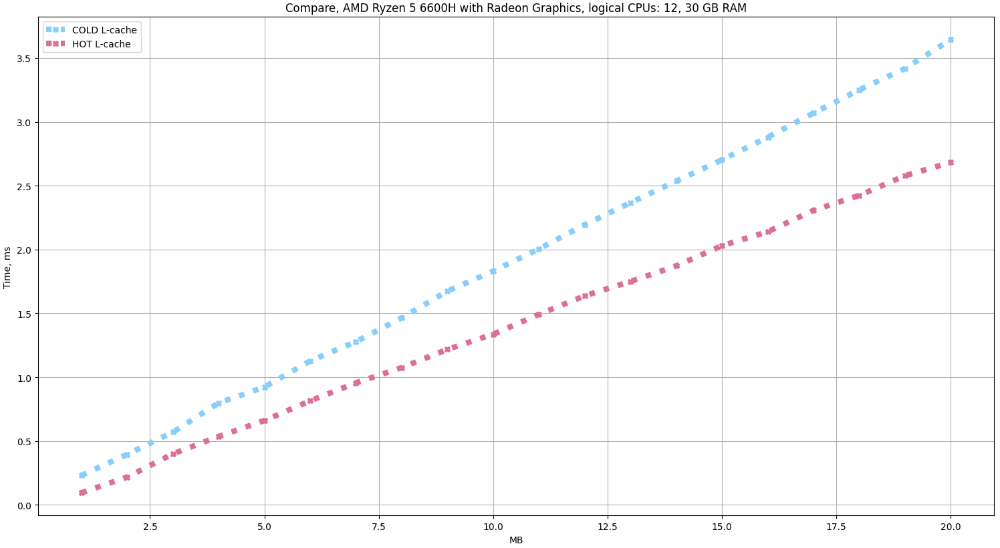

# Another run is faster

It's no secret that the processor has a cache with 1,2,3 levels. 
But what will be the efficiency when we run the same code twice.
From a philosophical point of view, there is an ideal situation when the time complexity of the second run will be close to O(1).
But the ideal situation is unattainable. It was decided to conduct an experiment.

It is proposed to prepare arrays ranging in size from 1 megabyte to 20 megabytes.
And for these arrays, it is proposed to run the same algorithm twice in a pipe.

```golang
data[0] = 17
for i := 1; i < size; i++ {
    data[i] = data[i-1] + 3
}
``` 

The results of the comparison are shown in the diagram.



## Conclusion.

The cache greatly facilitates re-computation. If the computing structures are small, then the gain can be up to x2 for a given processor.
